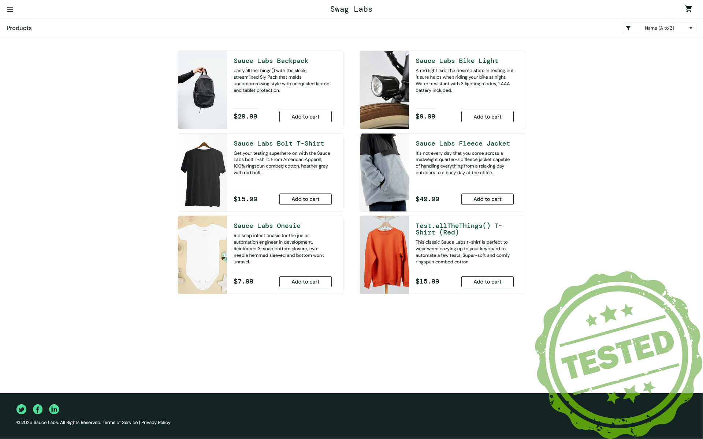

SwagLabs Test Automation Project
================================

Overview
--------

This project is an automation testing framework developed using Python and Selenium WebDriver. The primary goal of the project is to perform functional and visual regression tests for the **Sauce Demo** application ([https://www.saucedemo.com/](https://www.saucedemo.com/)), a popular web application used for testing and training purposes.
The tests aim to ensure the stability of key functionalities such as login, inventory page rendering, and menu navigation. Additionally, the project implements visual regression testing, ensuring that any UI changes are detected automatically.

Project Structure
-----------------

*   **tests/**: Contains the test scripts for different application pages and features.
*   **pages/**: Houses the page objects for the various components of the Sauce Demo application (e.g., Login, Inventory, etc.).
*   **utilities/**: Includes utility functions for common tasks such as menu navigation and resetting the app state.
*   **.gitignore**: Specifies which files and directories should be ignored by Git.

Built with:
-----------

Features
--------

*   **Functional Testing**: Verifies that critical application features like login, inventory, and user interactions work correctly.
*   **Visual Regression Testing**: Compares screenshots to detect any unexpected changes in the UI, leveraging tools like Applitools.
*   **Headless Mode**: Runs tests in headless mode, ensuring that the tests can run on CI/CD pipelines without a graphical user interface.

Setup Instructions
------------------
1. Clone the repository:
        git clone <repository-url>
        cd test_swagLabs
2. Build the Docker image:
        docker build -t test_swaglabs .
3. Run the Docker container:
        docker run --rm test_swaglabs
This will build the Docker image and run the tests inside the Docker container. The test results and logs will be available at [http://localhost:5050](http://localhost:5050), provided by .

